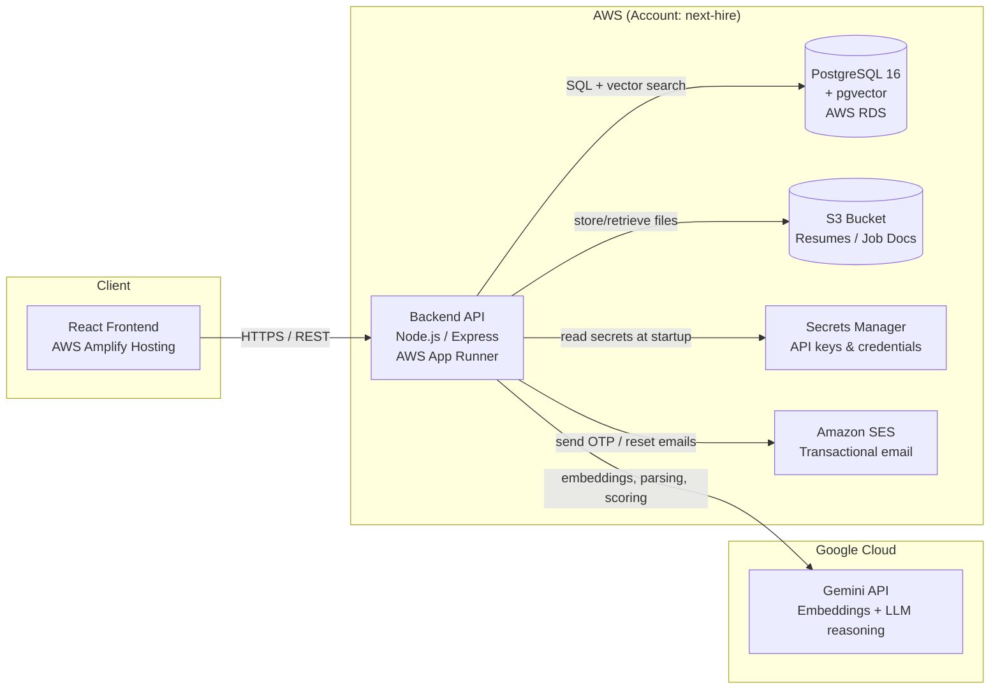
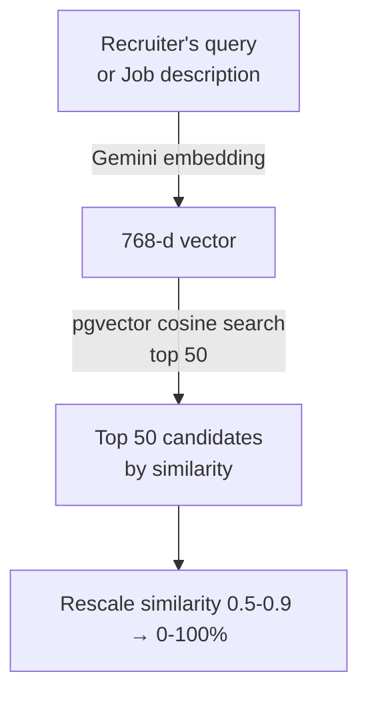
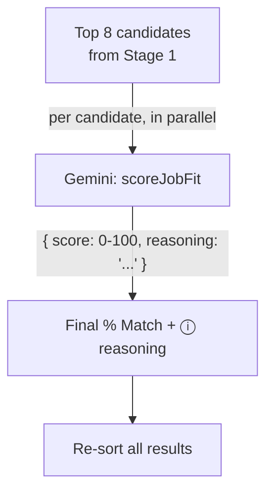

# Next Hire — AI-Powered Candidate Search: Architecture & Design

This document explains, in plain terms, how Next Hire's AI candidate-matching
feature works end to end: the cloud infrastructure it runs on, how candidate
and job data is stored, how the AI generates a "% Match" score and
explanation, and exactly what is sent to the AI provider (Google Gemini) and
why.

---

## 1. High-Level Architecture



**Everything the recruiter does in the browser** (search candidates, upload a
resume, ask the AI search box to "find me a hotel manager") goes through one
backend API. The backend is the only component that talks to the database and
to Google's Gemini AI service — the frontend never calls Gemini directly, and
never sees the API key.

---

## 2. AWS Infrastructure (what's actually running)

All infrastructure is defined as code (AWS CDK) so it's reproducible and
auditable. The pieces:

| Resource | Service | Purpose |
|---|---|---|
| **next-hire-backend** | AWS App Runner (0.25 vCPU / 0.5 GB) | Runs the Node.js/Express API. Auto-deploys from the `main` branch on every push. |
| **next-hire-frontend** | AWS Amplify Hosting | Builds & serves the React app. Auto-deploys from `main`. |
| **Database** | AWS RDS for PostgreSQL 16 (`db.t4g.micro`, free-tier eligible) | The single source of truth for users, candidates, jobs, applications, etc. Has the **pgvector** extension enabled for AI similarity search. SSL-only connections. |
| **DocumentsBucket** | Amazon S3 (private) | Stores uploaded résumés and job-description files used by the "parse with AI" features. |
| **Secrets** | AWS Secrets Manager | Stores the DB password, JWT signing keys, the email-provider key, and the **Gemini API key**. Never stored in code or in the repo. |
| **Email** | Amazon SES | Sends OTP / password-reset / notification emails via the backend's IAM role (no SMTP passwords to manage). |
| **IAM Role** | App Runner instance role | Scoped permissions so the backend container can read the secrets above, read/write the documents bucket, and send email — nothing more. |

There is no separate "AI server" — the AI calls happen from inside the
existing backend service, using the Gemini API key pulled from Secrets
Manager at runtime.

---

## 3. Database Design

### 3.1 Core tables (existing)

Standard relational tables: `users`, `candidates`, `jobs`, `experiences`,
`education`, `candidate_skills`, `submissions`, etc. — recruiters, vendors and
candidates all read/write through these via normal SQL.

### 3.2 The "AI layer" added on top

To support semantic (meaning-based) search, two columns were added to
`candidates` and `jobs`:

| Column | Type | Purpose |
|---|---|---|
| `embedding` | `TEXT` (JSON array of 768 numbers) | Portable copy of the AI "fingerprint" of the record. Always present if AI is available. |
| `embedding_vector` | `vector(768)` (pgvector type, Postgres only) | The same fingerprint stored as a native vector, with an **HNSW index** for fast similarity search. |

These are kept in sync automatically — whenever a candidate or job's
embedding is generated/updated, both columns are written in the same step.

**What is "embedded" (turned into a fingerprint)?**

- **Candidate** → name, most recent job title & employer, total years of
  experience, bio/summary, skills, most recent education, location.
- **Job** → title, company, location, full description, required skills,
  preferred skills.
- **Search query** → the recruiter's free-text query, as typed (e.g. *"find
  me a hotel manager"*).

### 3.3 Why pgvector + HNSW?

`pgvector` lets Postgres store these 768-number fingerprints as a native
`vector` type and search them with a cosine-distance operator (`<=>`).
The **HNSW index** makes "find the 50 candidates whose fingerprint is closest
to this query's fingerprint" a fast, indexed database query rather than a
slow full-table scan — this is what lets the AI search box search the *entire*
candidate database, not just a sample.

```sql
-- Run automatically at startup (idempotent):
CREATE EXTENSION IF NOT EXISTS vector;
ALTER TABLE candidates ADD COLUMN IF NOT EXISTS embedding_vector vector(768);
CREATE INDEX IF NOT EXISTS candidates_embedding_idx
  ON candidates USING hnsw (embedding_vector vector_cosine_ops);
-- (same for jobs)
```

---

## 4. The AI Provider: Google Gemini

### 4.1 Role of the `GEMINI_API_KEY`

A single API key (`GEMINI_API_KEY`), stored in AWS Secrets Manager and
injected into the backend at runtime, authenticates **all** AI calls. It is
used for three distinct jobs:

1. **Embeddings** — model `gemini-embedding-001`, requested at 768 dimensions.
   Turns text (a candidate profile, a job description, or a search query)
   into a 768-number vector for similarity search. *No reasoning, just a
   "fingerprint".*

2. **Document parsing** — a chain of Gemini "flash" models (fast, low-cost)
   reads an uploaded résumé or job description and returns structured JSON
   (name, skills, experience, salary range, etc.) used to create the
   candidate/job record automatically.

3. **Match scoring & reasoning** — the same model chain reads a job/query
   plus a candidate's profile and returns a calibrated 0–100 fit score *and a
   one-sentence explanation*. This is the "real AI" step that powers the
   "% Match" badge and the **ⓘ reasoning tooltip** in the UI.

### 4.2 Model fallback chain

For (2) and (3), the backend tries several models **in order** and uses the
first one that responds successfully — this protects against any single
model being temporarily overloaded or rate-limited:

```
gemini-2.5-flash → gemini-2.0-flash-001 → gemini-2.0-flash
  → gemini-flash-latest → gemini-2.5-flash-lite → gemini-2.0-flash-lite
```

Each attempt has a 15-second timeout. If **all** models fail (e.g. the
account's daily Gemini quota is exhausted), the system does **not** error out
to the recruiter — it falls back to a deterministic score (see §5.3) and
clearly labels it as such.

---

## 5. How the "% Match" Score Is Calculated

There are two scenarios that feed the same scoring pipeline:

- **"Find Matching Candidates"** from a Job posting → query = the job's
  title/description/skills.
- **AI search box** ("Describe the ideal candidate in natural language") →
  query = the recruiter's free-text sentence.

### Stage 1 — Embedding Retrieval (fast, deterministic, whole database)



1. The query text is embedded into a 768-number vector via Gemini.
2. Postgres/pgvector finds the **50 candidates** whose stored fingerprint is
   closest to that vector (cosine similarity), using the HNSW index — this
   covers the *entire* candidate database, not a page at a time.
3. Raw cosine similarity for real (non-identical) text pairs typically falls
   in a 0.5–0.9 range. That range is **rescaled to 0–100%**, so a truly
   unrelated profile reads close to 0% instead of a misleading "50%".
4. A secondary signal is blended in:
   - **Job-based matching**: 70% rescaled similarity + 30% *skill overlap*
     (fraction of the job's required/preferred skills the candidate actually
     lists).
   - **Free-text search**: 40% rescaled similarity + 60% *keyword overlap*
     (fraction of meaningful words in the recruiter's query that literally
     appear in the candidate's profile — e.g. "hotel", "manager"). This keeps
     short queries from under-scoring an obvious match before the AI step
     below runs.

This stage produces an initial ranked list and is also the **safety-net
score** if Stage 2 is unavailable.

### Stage 2 — AI Reranking (the "real AI" judgment)



1. Only the **top 8** candidates from Stage 1 are sent to Gemini (keeps cost
   and latency bounded).
2. For each, Gemini receives the query/job text **and** a compact summary of
   that candidate's profile, and is asked to return a score + one-sentence
   reasoning (prompt shown in §6.3).
3. If Gemini responds successfully, **its score and reasoning replace** the
   Stage 1 score for that candidate — this is what the recruiter sees as the
   "% Match" badge and the ⓘ tooltip.
4. Results are re-sorted by the final score.

### 5.3 Fallback behavior (AI temporarily unavailable)

If Gemini's reasoning step fails for a candidate (rate limit, timeout, etc.),
that candidate **keeps their Stage 1 score** and the tooltip explicitly says:

> *"AI reasoning is temporarily unavailable — this score reflects keyword and
> profile similarity only."*

This guarantees the search box always returns a sensible, correctly-ranked
result — never a blank or broken response — even if the AI provider is
degraded.

---

## 6. Prompts Used

All prompts instruct Gemini to return **JSON only** (no markdown, no
commentary), which the backend parses directly. Text is truncated to a
bounded size before being sent (résumé/job text ≤ 15,000 characters, profile
text ≤ 6,000 characters) to control cost and latency.

### 6.1 Résumé Parsing Prompt (summary)

> *"You are an expert resume parser. Read the resume text below and return
> ONLY a single valid JSON object with this shape: `name, email, phone,
> location, linkedin_url, portfolio_url, current_employer,
> current_job_title, total_experience_years, skills[{name, category}],
> education[...], experience[...], certifications[], summary`."*

Includes explicit rules: never invent data not present in the text, normalize
skill names/capitalization, categorize skills (technical / soft / language /
certification / other), estimate total years of experience from work history
if not stated, etc.

### 6.2 Job Description Parsing Prompt (summary)

> *"You are an expert job description parser. Read the job posting text below
> and return ONLY a single valid JSON object with this shape: `title,
> company_name, location, city, state, country, job_type, salary_min,
> salary_max, salary_currency, experience_min_years, experience_max_years,
> required_skills[], preferred_skills[], education_requirements,
> description, positions_available`."*

### 6.3 Match-Scoring Prompt (the "% Match" + reasoning)

This is the exact rubric given to Gemini for every Stage-2 candidate:

> *"You are an expert technical recruiter. Score how well the CANDIDATE
> profile matches the JOB on a 0-100 scale, using these anchors:*
> - *0-15: Different field entirely; no relevant skills, tools, or experience
>   overlap.*
> - *16-40: A few transferable/soft skills, but the domain and core skills
>   don't match.*
> - *41-65: Adjacent field with some overlapping skills or tools; would need
>   notable ramp-up.*
> - *66-85: Strong alignment — most required skills and relevant experience
>   match.*
> - *86-100: Exceptional match — directly relevant experience and skills at
>   the right level.*
>
> *Be honest and discriminating: an unrelated profession (e.g. hospitality vs.
> software engineering) must score in the 0-15 range, not a "coin flip".*
>
> *JOB: """{query or job description}"""*
>
> *CANDIDATE PROFILE: """{name, latest role, years of experience, bio,
> skills, education, location}"""*
>
> *Respond with ONLY: `{"score": <integer 0-100>, "reasoning": "<one concise
> sentence>"}`"*

---

## 7. Putting It Together — Example

Recruiter types **"find me a hotel manager"** into the AI search box:

1. The phrase is embedded → 768-number vector.
2. pgvector scans all candidate fingerprints, returns the 50 closest.
3. Each gets a Stage-1 score (similarity + keyword overlap with "hotel",
   "manager").
4. The top 8 are sent to Gemini with the prompt above and a summary of each
   candidate's profile (e.g. *"MANTHA TRILOKESWAR. General Manager at Suraj
   Group of Hotels. 34 years of professional experience. Skills: Hotel
   Management Systems, F&B Operations, Revenue Management..."*).
5. Gemini returns, e.g., `{"score": 94, "reasoning": "Directly relevant —
   34 years as a hotel general manager with hands-on revenue management and
   F&B operations experience."}`.
6. The UI shows **94% Match** with a green badge, and the reasoning appears
   in the ⓘ tooltip beside it.

If Gemini is unreachable at that moment, the recruiter would instead see the
Stage-1 fallback score (still correctly ranking this candidate first, based on
the keyword/semantic blend) with the "AI reasoning temporarily unavailable"
note.

---

## 8. Security & Data Handling

- The Gemini API key lives only in AWS Secrets Manager and the backend's
  runtime environment — it is never exposed to the browser or committed to
  source control.
- All AI calls happen server-side; the frontend only ever sees the final
  score, reasoning text, and (if applicable) parsed JSON fields.
- Résumé/job-description files uploaded for AI parsing are stored in a
  private S3 bucket (no public access) and accessed only via short-lived
  signed URLs.
- The database connection enforces SSL, and credentials are pulled from
  Secrets Manager at startup — never hardcoded.
